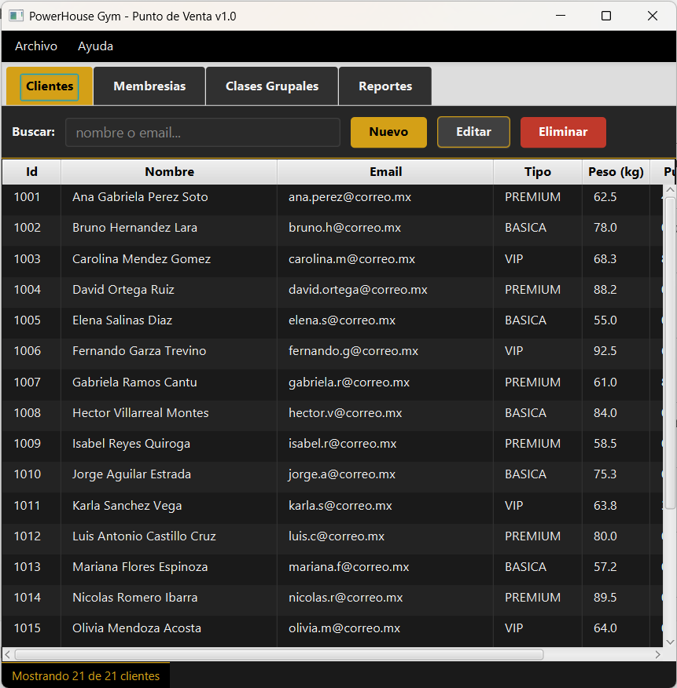
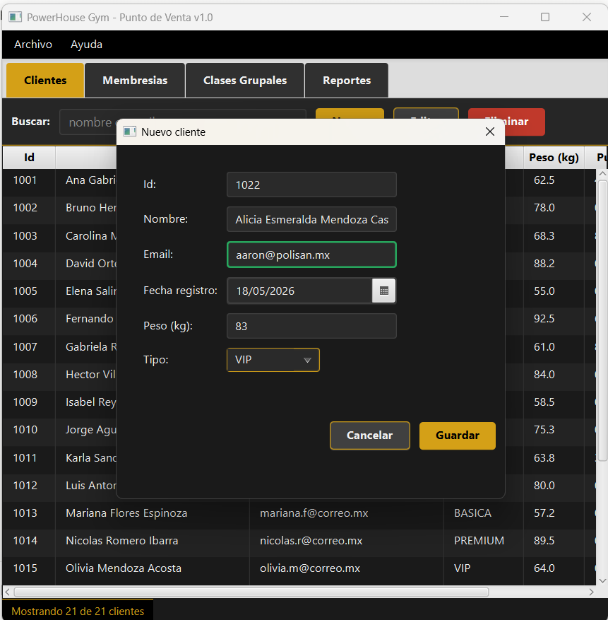
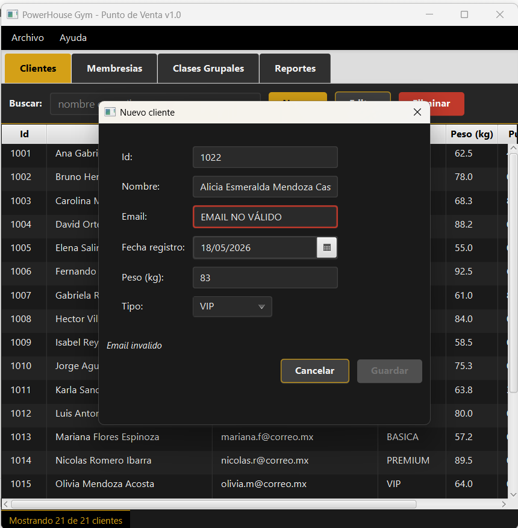
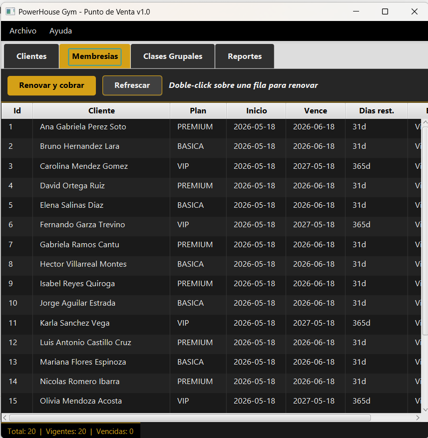
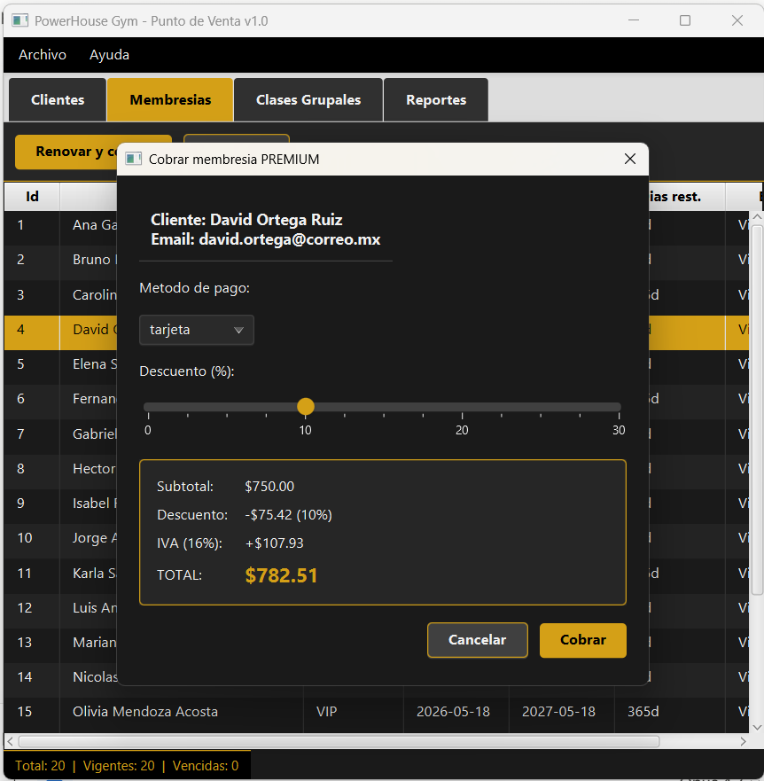
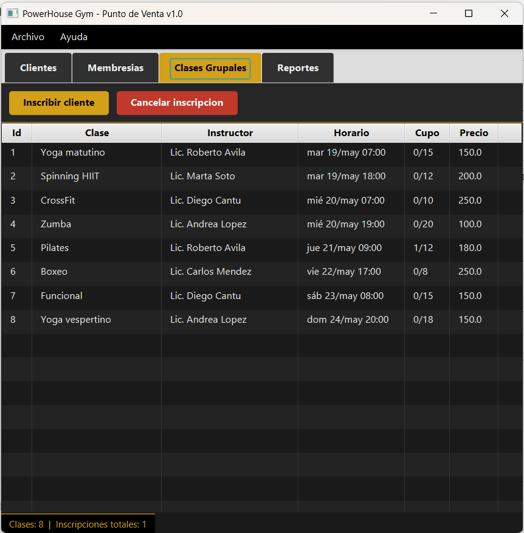
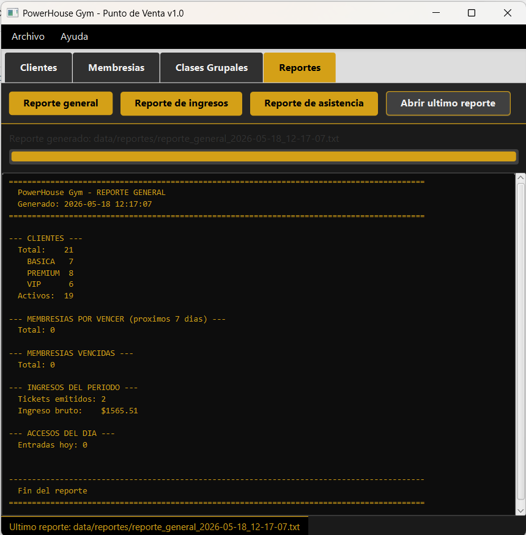

# Manual de Usuario — GymPOS

**Sistema de Punto de Venta para Gimnasio**
Versión 1.0

---

## Bienvenida

GymPOS es la aplicación de escritorio que el equipo del gimnasio usa día a día para administrar clientes, cobrar membresías, gestionar clases grupales, consultar el inventario de equipos y generar reportes. Este manual te lleva paso a paso por cada función con capturas de pantalla.

---

## 1. Instalación y primer arranque

### Requisitos previos

- Computadora con Windows 10/11, macOS o Linux.
- Java 21 (LTS) instalado.
- 200 MB de espacio en disco.

### Instalación

1. Recibirás un archivo `gympos-1.0.0.jar` (o las fuentes en un ZIP).
2. Si tienes el JAR: ejecuta `java -jar gympos-1.0.0.jar` desde la terminal en la carpeta donde lo guardaste.
3. Si tienes las fuentes: ejecuta `mvn javafx:run` desde la carpeta raíz.

### Primera ejecución

La primera vez que abras GymPOS, el sistema **se siembra automáticamente** con 20 clientes de prueba, 8 clases grupales programadas y 12 equipos. Esto te permite explorar la aplicación con datos significativos antes de cargar tus datos reales.

A partir de la segunda ejecución, GymPOS carga lo que guardaste en la sesión anterior. Los datos persisten en archivos `.dat` dentro de la carpeta `data/`.



*Figura 1. Pantalla principal con la pestaña Clientes activa, mostrando los 20 registros precargados.*

---

## 2. La ventana principal

La ventana se divide en cuatro zonas:

- **Barra de menú** (arriba): contiene los menús **Archivo** y **Ayuda**.
- **Pestañas** (debajo del menú): cuatro pestañas para los módulos principales: **Clientes**, **Membresías**, **Clases Grupales** y **Reportes**.
- **Área de contenido**: cambia según la pestaña activa.
- **Barra de estado** (abajo): muestra información contextual como el total de registros o el último reporte generado.

### Atajos de teclado globales

| Atajo | Acción |
|---|---|
| `Ctrl+S` | Guardar todo el estado en disco |
| `Ctrl+B` | Crear un backup manual con timestamp |
| `Ctrl+Q` | Salir de la aplicación (con backup automático si está habilitado) |

---

## 3. Módulo Clientes

Es la pestaña que ves al abrir la aplicación. Permite registrar nuevos clientes, consultar el padrón, editar datos y dar de baja.

### 3.1 Consultar el padrón

La tabla muestra todos los clientes registrados con: id, nombre, email, tipo de membresía, peso, puntos acumulados y estado (Activo / Inactivo).

Para **ordenar** por cualquier columna, haz click en su encabezado. Un segundo click invierte el orden. Funciona también cuando hay un filtro de búsqueda activo: solo se reordenan los resultados visibles.

### 3.2 Buscar clientes

Escribe en el campo **"Buscar"** de la toolbar. La tabla se filtra **en tiempo real** mostrando solo los clientes cuyo nombre o email contenga el texto buscado.

Ejemplos:
- Escribir `ana` muestra a Ana Gabriela Perez Soto.
- Escribir `@correo.mx` muestra a todos los del dominio.

Borrar el campo restaura la lista completa.

### 3.3 Registrar un cliente nuevo

Tres formas equivalentes:

1. Botón **"Nuevo"** de la toolbar.
2. Menú... (próximamente en el menú Clientes).
3. *(En el formulario)* presiona Enter para guardar.

Al hacer click se abre un diálogo modal:



*Figura 2. Formulario modal para alta de cliente. El botón "Guardar" se habilita solo cuando todos los campos son válidos.*

Llena los campos:
- **Id**: número entero único positivo (no se puede repetir).
- **Nombre**: nombre completo del cliente.
- **Email**: dirección válida. El campo cambia a verde cuando el formato es correcto, rojo cuando no.
- **Fecha de registro**: por defecto la fecha actual.
- **Peso (kg)**: entre 30 y 300. Acepta 0 si aún no se ha medido.
- **Tipo de membresía**: BASICA, PREMIUM o VIP.

#### Validación de email en vivo

Si escribes un email mal formado, el campo se pone rojo y aparece un tooltip explicando el problema:



*Figura 3. El campo Email muestra borde rojo y tooltip cuando el formato no es válido.*

Cuando todos los campos son válidos, el botón **"Guardar"** se habilita. Presiónalo (o tecla Enter) para confirmar. El nuevo cliente aparece inmediatamente en la tabla y queda seleccionado.

Si el id ya existe o el email está duplicado, GymPOS muestra una alerta y no agrega al cliente.

### 3.4 Editar un cliente existente

Cuatro formas equivalentes:
- **Doble-click** sobre la fila del cliente.
- Seleccionar y presionar **Enter** sobre la tabla.
- Seleccionar y click en **"Editar"** de la toolbar.

Se abre el mismo diálogo de la sección anterior, **pre-llenado** con los datos actuales. El campo Id queda bloqueado (no se debe cambiar el identificador). Modifica lo que necesites y Guarda.

### 3.5 Eliminar un cliente

Tres formas:
- Seleccionar y presionar tecla **Delete**.
- Seleccionar y click en **"Eliminar"** (botón rojo).

Aparece un diálogo de confirmación con el nombre y email del cliente. La operación es irreversible una vez confirmada.

---

## 4. Módulo Membresías

La pestaña **Membresías** muestra todas las membresías del sistema, su estado y permite renovarlas con cobro.

### 4.1 Consultar membresías



*Figura 4. Pestaña Membresías mostrando el estado de cada plan: vigente, por vencer o vencida.*

Cada fila muestra:
- Id de la membresía.
- Cliente asociado.
- Plan (BASICA, PREMIUM, VIP).
- Fecha de inicio y de vencimiento.
- Días restantes (o cuántos días lleva vencida).
- Estado de color: **Vigente**, **Por vencer** (próximos 7 días) o **Vencida**.

La barra inferior muestra el conteo total: vigentes y vencidas.

### 4.2 Renovar y cobrar

Es el flujo más importante del módulo. **Doble-click** sobre una membresía abre el diálogo de cobro:



*Figura 5. Diálogo de cobro con desglose en vivo. El slider permite aplicar descuentos hasta 30%.*

El diálogo muestra:
- **Cabecera con datos del cliente** (nombre y email).
- **Método de pago**: tarjeta, efectivo o transferencia.
- **Slider de descuento**: arrástralo para aplicar entre 0% y 30%.
- **Desglose en vivo**: subtotal, descuento, IVA (16%) y total se recalculan automáticamente al mover el slider.

Click en **"Cobrar"** intenta procesar el pago. El sistema simula la comunicación con el banco (con 90% de éxito):

- **Si el cobro es exitoso**: se renueva la membresía con la duración del plan, se generan los puntos correspondientes (1 punto por peso pagado), más 50 puntos bonus por renovación. La tabla se actualiza.

- **Si el cobro es rechazado**: aparece un diálogo de error con todos los detalles necesarios para dar seguimiento al cliente:
  - Mensaje del banco.
  - Código de error interno.
  - Referencia única (se la das al cliente si necesita aclarar con su banco).
  - Monto y método.

### 4.3 Refrescar la tabla

Si hubo cambios en otra pestaña (por ejemplo, agregaste un cliente nuevo), el botón **"Refrescar"** vuelve a leer las membresías.

---

## 5. Módulo Clases Grupales

La pestaña **Clases Grupales** muestra el calendario de las clases programadas (yoga, spinning, CrossFit, etc.) y permite inscribir o cancelar inscripciones.

### 5.1 Ver el calendario



*Figura 6. Pestaña Clases Grupales con las 8 clases precargadas y su cupo actual.*

Cada clase muestra:
- Id.
- Nombre (Yoga matutino, Spinning HIIT, etc.).
- Instructor.
- Horario (día y hora).
- Cupo actual / cupo máximo.
- Precio.

### 5.2 Inscribir un cliente

1. Selecciona la clase en la tabla.
2. Click en **"Inscribir cliente"**.
3. Aparece un selector con todos los clientes registrados.
4. Elige al cliente y confirma.

Si la clase está llena, GymPOS muestra el error: *"Cupo excedido en '<nombre clase>': X/X inscritos."*. No se permite inscribir más allá del cupo máximo.

Si el cliente ya estaba inscrito en esa clase, la operación se ignora silenciosamente (no se duplica).

### 5.3 Cancelar una inscripción

1. Selecciona la clase.
2. Click en **"Cancelar inscripción"** (botón rojo).
3. Aparece un selector con los clientes actualmente inscritos en esa clase.
4. Elige al cliente y confirma.

---

## 6. Módulo Reportes

La pestaña **Reportes** permite generar reportes en formato TXT que se guardan en `data/reportes/`. Cada reporte incluye timestamp en el nombre, así que no se sobrescriben.

### 6.1 Tipos de reporte

- **Reporte general**: estado completo del gimnasio. Clientes por tipo, membresías por vencer y vencidas, ingresos del período y accesos del día.
- **Reporte de ingresos**: lista de todos los tickets emitidos en la sesión actual, con subtotal, descuento, IVA y total.
- **Reporte de asistencia**: entradas y salidas del día, con hora y torniquete.

### 6.2 Generar un reporte

Click en cualquiera de los tres botones. Lo que pasa:

1. La barra de progreso comienza a llenarse.
2. El sistema procesa los datos en **un hilo de fondo**. La aplicación sigue respondiendo: puedes cambiar de pestaña, hacer otras operaciones, etc.
3. Cuando termina, el TextArea de abajo muestra el **contenido completo del reporte**, formateado en columnas alineadas.



*Figura 7. Reporte general generado. La vista previa muestra el TXT con columnas alineadas. El archivo queda guardado en data/reportes/ con timestamp.*

### 6.3 Abrir el reporte en otro programa

Click en **"Abrir último reporte"** lanza el visor predeterminado del sistema (Notepad en Windows, TextEdit en macOS) para que puedas imprimirlo o compartirlo.

---

## 7. Persistencia y backups

### 7.1 Guardado automático

GymPOS guarda automáticamente al cerrar la aplicación. También puedes guardar manualmente en cualquier momento con `Ctrl+S` o desde el menú **Archivo → Guardar todo**.

Los datos persistidos:
- `data/clientes.dat`
- `data/membresias.dat`
- `data/accesos.dat`
- `data/clases.dat`
- `data/equipos.dat`

Estos archivos son **binarios serializados** (no son texto editable manualmente).

### 7.2 Backups con timestamp

Cada vez que cierras la aplicación, GymPOS crea automáticamente una copia de seguridad de todos los archivos `.dat` en `data/backups/`. Los nombres llevan timestamp:

```
data/backups/
├── clientes_2026-05-15_22-30-15.dat
├── membresias_2026-05-15_22-30-15.dat
├── accesos_2026-05-15_22-30-15.dat
└── ...
```

Aparece una ventana de progreso mientras se hace el backup, antes de cerrar la aplicación.

También puedes crear un backup manual con `Ctrl+B` o **Archivo → Crear backup ahora**.

### 7.3 Recuperar datos desde un backup

Si los archivos `.dat` actuales se corrompen, puedes recuperar copiando manualmente desde `data/backups/`:

1. Cierra GymPOS.
2. En `data/backups/`, busca el backup con la fecha que quieres recuperar (e.g. `clientes_2026-05-14_18-00-00.dat`).
3. Cópialo a `data/` y renómbralo a `clientes.dat`.
4. Repite para los demás archivos.
5. Abre GymPOS de nuevo.

---

## 8. Configuración (config.properties)

El archivo `config.properties` en la raíz del proyecto permite ajustar varios parámetros sin tocar código:

```properties
gym.nombre=PowerHouse Gym                    # Nombre que aparece en reportes
fiscal.iva=0.16                              # IVA aplicado a cobros (16%)
membresia.basica.precio=400                  # Precio mensual basica
membresia.premium.precio=750                 # Precio mensual premium
membresia.vip.precio.anual=8000              # Precio ANUAL VIP
puntos.por.peso.pagado=1                     # Puntos por cada peso pagado
puntos.bonus.renovacion=50                   # Bonus al renovar
backup.automatico.al.cerrar=true             # Hacer backup al cerrar
```

Después de modificar el archivo, **reinicia la aplicación** para que los cambios tomen efecto.

---

## 9. Atajos de teclado completos

| Atajo | Acción | Contexto |
|---|---|---|
| **Ctrl+S** | Guardar todo | Cualquier pestaña |
| **Ctrl+B** | Crear backup ahora | Cualquier pestaña |
| **Ctrl+Q** | Salir | Cualquier pestaña |
| **Delete** | Eliminar seleccionado | Tablas |
| **Enter** | Editar seleccionado | Tablas |
| **Doble-click** | Editar / cobrar | Tablas |
| **Enter** | Guardar formulario | Diálogos modales |
| **Escape** | Cancelar | Diálogos modales |

---

## 10. Resolución de problemas

### "La aplicación no abre"

Causas comunes:
- Java 21 no está instalado o no está en el PATH. Prueba `java -version` en una terminal.
- Falta JavaFX si ejecutas con `java -jar` desde un JAR que no es el "fat jar". Asegúrate de compilar con `mvn clean package` (no `mvn compile`).

### "Error al iniciar GymPOS"

Si el sistema muestra este Alert al inicio:
1. Revisa `data/operaciones.log` — la última línea suele indicar la causa.
2. Si dice "no se pudo leer config.properties", verifica que el archivo exista en la raíz.
3. Si dice "no se pudo deserializar clientes.dat", probablemente el archivo está corrupto. Recupera desde un backup (sección 7.3) o borra `data/` para que el sistema se siembre de nuevo con datos de prueba.

### "El cobro siempre falla"

El sistema simula un 10% de fallos aleatorios. Si tienes mala suerte y dos cobros seguidos fallan, intenta una tercera vez — es estadísticamente normal.

### "No aparecen los datos que ingresé ayer"

GymPOS guarda automáticamente al cerrar. Si la app se cerró de forma anormal (corte de energía, crash), los cambios de la sesión podrían no estar persistidos. Acostúmbrate a presionar `Ctrl+S` después de cambios importantes.

### "La búsqueda no encuentra al cliente"

La búsqueda solo mira **nombre completo** y **email**. No busca por id ni por tipo de membresía. Si quieres ordenar por tipo, haz click en el encabezado de la columna "Tipo".

---

## 11. Acerca de

GymPOS — Sistema de Punto de Venta para Gimnasio.
Proyecto Integrador del Laboratorio de Programación Orientada a Objetos.

**Autor**: César Aarón Mendoza Benavides
**Matrícula**: 1904833
**Stack**: Java 21 + JavaFX 21.0.2 + Maven 3.8

Para soporte técnico, consultar el `MANUAL_TECNICO.md` o contactar al desarrollador.
